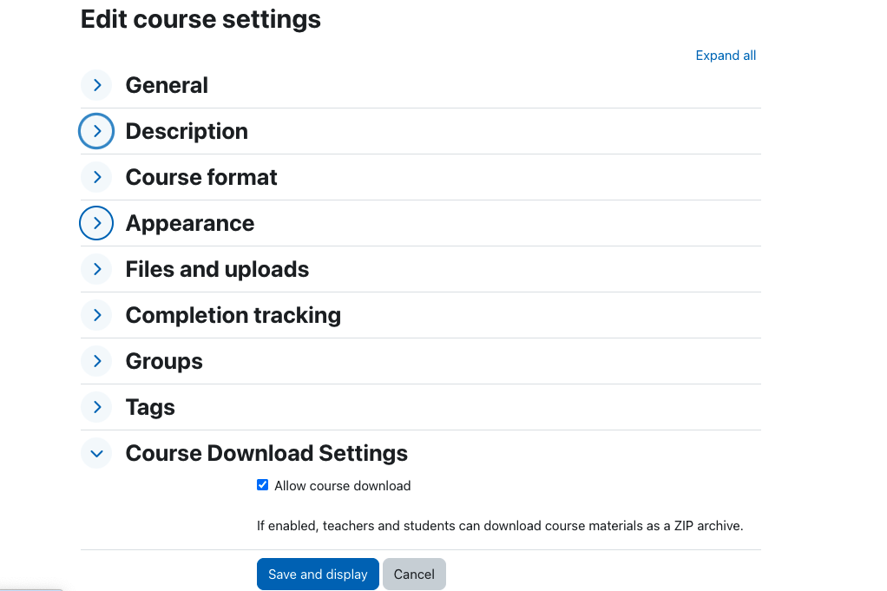
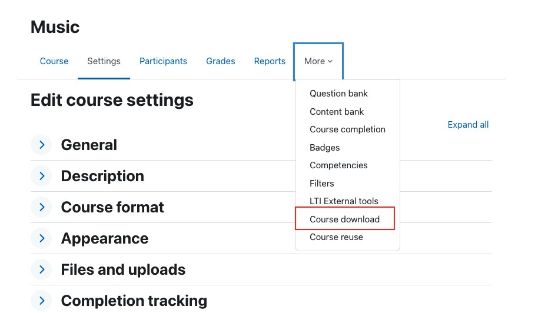

# Course Download Plugin

This plugin enables teachers to allow students to download course materials as a ZIP archive.

## Features

- Toggle course download functionality per course
- Integrated into Moodle's course settings
- Permission-based access control
- One-click download of course materials

## Configuration

### Step 1: Enable Course Download

In the course settings, under "Course Download Settings", you can enable or disable the download functionality:

The checkbox allows teachers to control whether course materials can be downloaded as a ZIP archive.

### Step 2: Access Course Download

Once enabled, the "Course download" option appears in the course navigation menu under "More":

Students with appropriate permissions can access the download link from this menu.

## Requirements

- Moodle 4.0 or higher
- PHP 7.4 or higher

## Installation

1. Download the plugin
2. Install via Moodle's plugin installation interface
3. Configure permissions as needed

## Permissions

The plugin uses the following capabilities:

- `local/coursedownload:downloadcoursecontent` - Allows users to download course content
- `local/coursedownload:configure` - Allows users to enable/disable course download

## License

GPL v3 or later

---

*Author:* manesvenom <manesvenom@gmail.com> 